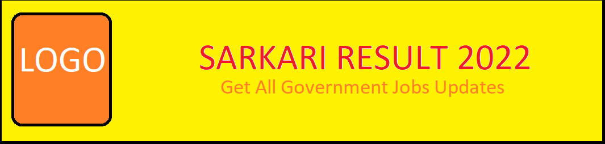
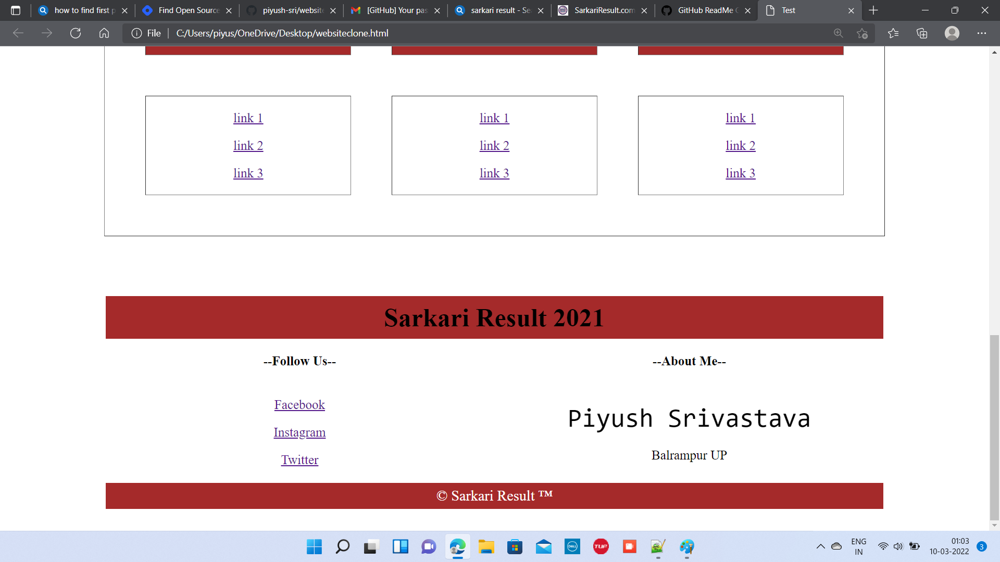
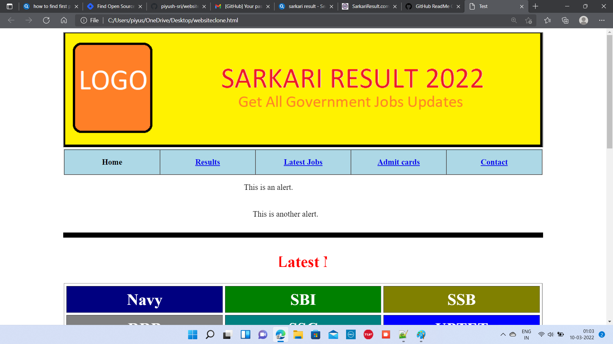
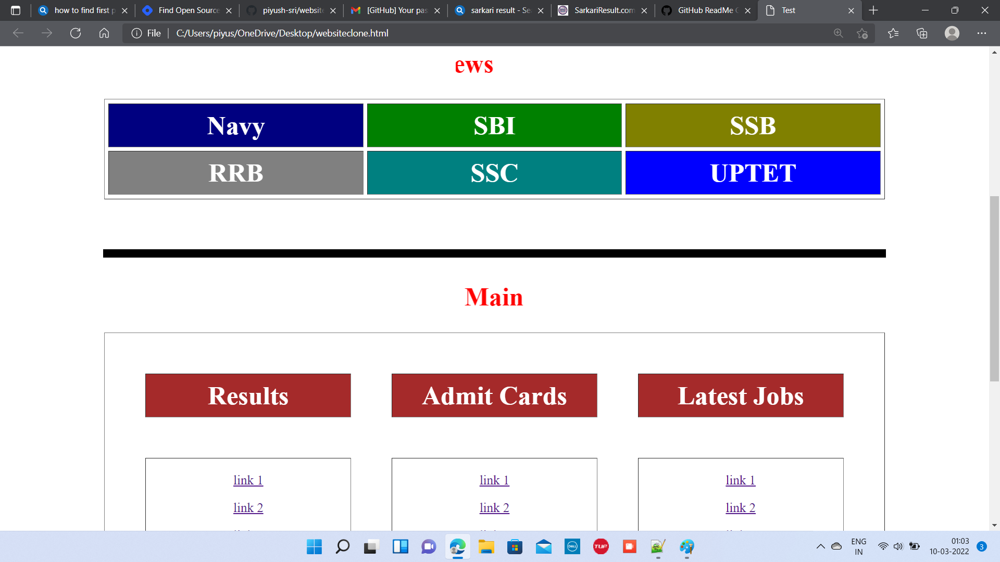

# html5-tutorials
 

  

  <h3 align="center">Sarkari Result Website Clone Using Only HTML. </h3>

  

    A Beginner Level Project to get Familier Using HTML Tags to create a Simple Website Clone.
     
     
    <a href="https://github.com/piyush-sri/Website Clone"><strong>Explore the docs »</strong></a>
     
     
    <a href="https://github.com/piyush-sri/Website Clone">View Demo</a>
    .
    <a href="https://github.com/piyush-sri/Website Clone/issues">Report Bug</a>
    .
    <a href="https://github.com/piyush-sri/Website Clone/issues">Request Feature</a>
  

     

## Table Of Contents

* [About the Project](#about-the-project)
* [Built With](#built-with)
* [Getting Started](#getting-started)
  * [Prerequisites](#prerequisites)
  * [Installation](#installation)
* [Usage](#usage)
* [Roadmap](#roadmap)
* [Contributing](#contributing)
* [License](#license)
* [Authors](#authors)
 

## About The Project

This Project Is Totally Created for the Beginners who had just started to Learn HTML, Follow the Steps to create your own Project learn the use of tags and get the Learning Resources attached down Below.

Header Logo is created Using MS PAINT . You can even use any image as a header as you want .

This Project is a Clone of the website  <a href=" https://www.sarkariresult.com/">SarkariResult.com</a>

Everything you see in this project is made by using only HTML.
I tried to touch each and every basic tags important to build a decent website . Beginners would take help and can even contribute by adding or even contributing to this project.

## Built With

This Project is Mainly Developed Using Basic HTML. The header Image is created using Simple Ms-Paint software. Easy for Beginners to Learn and grow and build their own first website likewise.

## Getting Started

 

### Prerequisites

 To Use this you need to copy the code from the repositories then paste it in any editor such as vs code or sublime ,Notepad++.
Save it using .html extension and then view it on any browser present in your system.

 

## Usage

 space. You may also link to more resources.

_For more examples, please refer to the [Documentation](https://example.com)_

## Roadmap

See the [open issues](https://github.com/piyush-sri/Website Clone/issues) for a list of proposed features (and known issues).

## Contributing

Contributions are what make the open source community such an amazing place to be learn, inspire, and create. Any contributions you make are **greatly appreciated**.
* If you have suggestions for adding or removing projects, feel free to [open an issue](https://github.com/piyush-sri/Website Clone/issues/new) to discuss it, or directly create a pull request after you edit the *README.md* file with necessary changes.
* Please make sure you check your spelling and grammar.
* Create individual PR for each suggestion.
* Please also read through the [Code Of Conduct](https://github.com/piyush-sri/Website Clone/blob/main/CODE_OF_CONDUCT.md) before posting your first idea as well.

### Creating A Pull Request

1. Fork the Project
2. Create your Feature Branch (`git checkout -b feature/AmazingFeature`)
3. Commit your Changes (`git commit -m 'Add some AmazingFeature'`)
4. Push to the Branch (`git push origin feature/AmazingFeature`)
5. Open a Pull Request

## License

Distributed under the MIT License. See [LICENSE](https://github.com/piyush-sri/Website Clone/blob/main/LICENSE.md) for more information.

## Authors

* **Piyush Srivastava** - *BCA Student* - [Piyush Srivastava]( https://github.com/piyush-sri) - * Website Clone*

 
